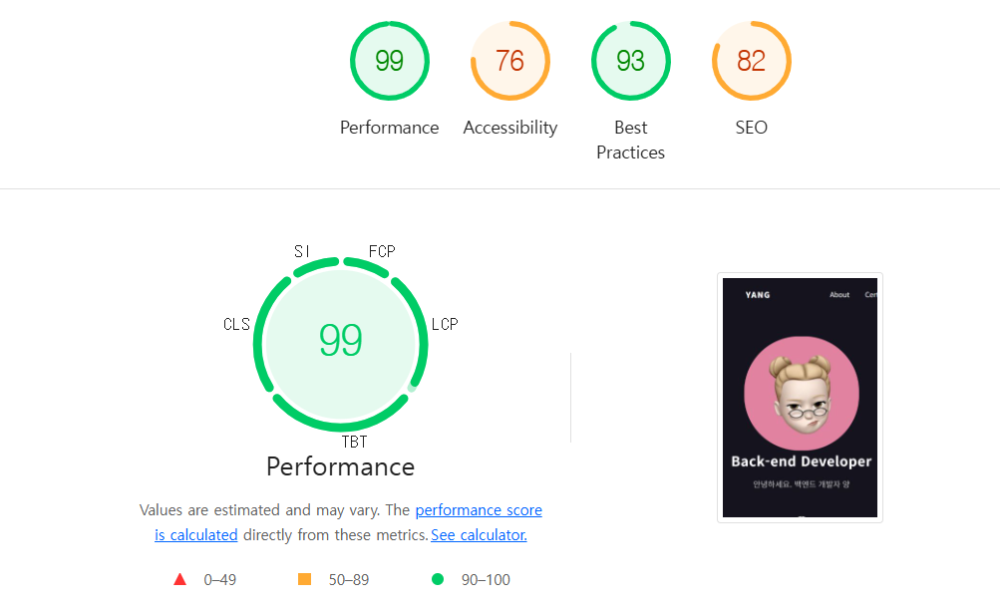
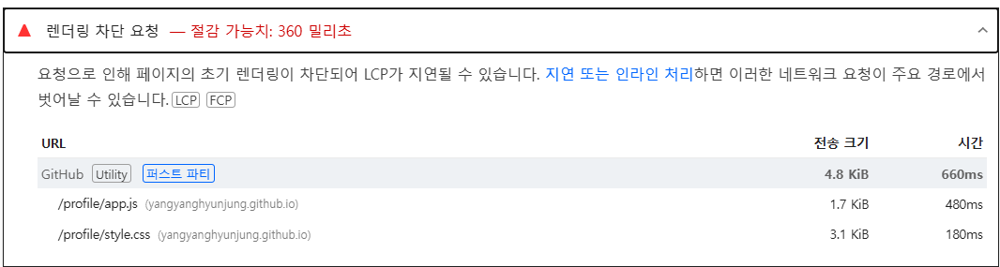
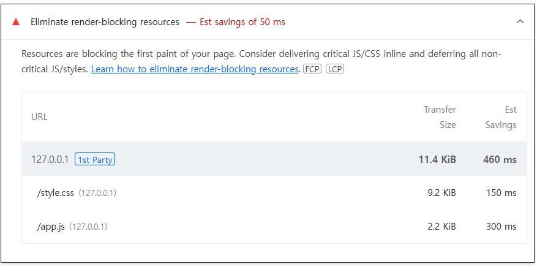
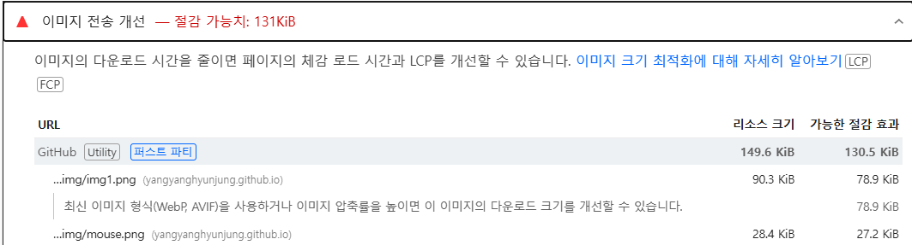
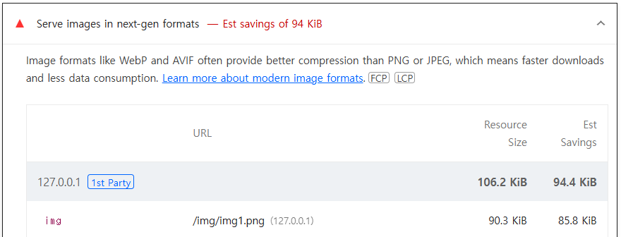
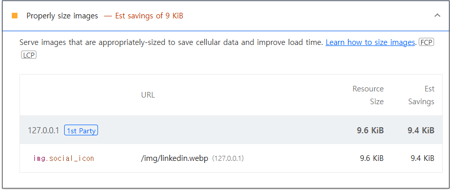

# 🚀LCP 성능 개선
LCP : 사용자가 처음 페이지에 접근했을 때 **화면에 표시되는 가장 큰 이미지나 동영상 혹은 텍스트 블록이 렌더링되는데 소요되는 시간**을 의미함
## 성능 개선 전


## 1. 렌더링 차단 요청


```javascript
<script defer scr="">
```
## 2. 이미지 압축 PNG -> Webp


## 3. 이미지 크기

- 사이즈 줄임

- 1. 리소스 용량 줄이기
- 2. 속도 낮춰서 하기 -> 성능이 낮은 폰에서도 내 앱은 빨리 된다
- 3. Rsource load duration 줄이기